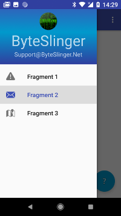
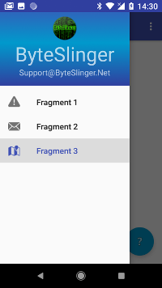
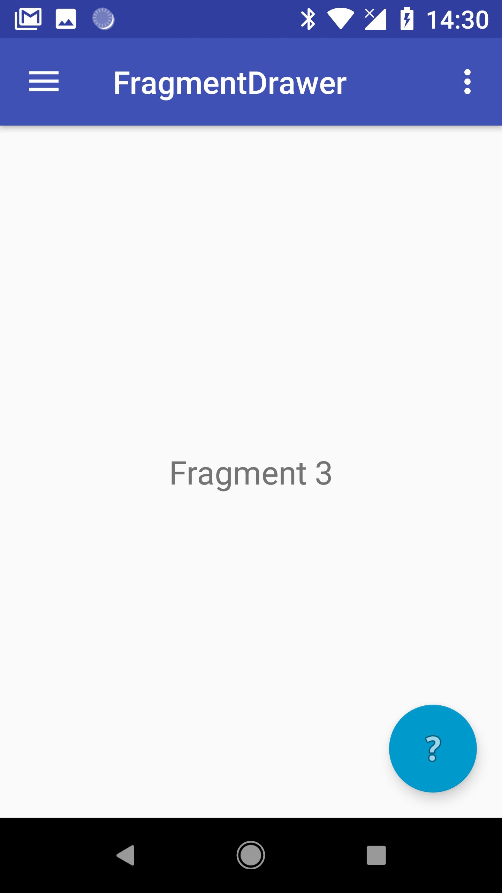
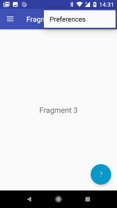

# FragmentDrawer
Sample Android Studio App (Java) with 1 Activity and a left side sliding drawer with a menu of items that load and display different Fragments.  There is also an AppBarLayout item and a FloatingActionButton that load and display Fragments.

It uses:

* NavigationView (design.widget.NavigationView)
* DrawerLayout (widget.DrawerLayout)
* AppBarLayout (design.widget.AppBarLayout)
* Toolbar (widget.Toolbar)
* Foating Action Button (widget.FloatingActionButton)

Here are the screenshots from the app:

|||||
|
|
|
||

(the last image, "Button", is the fragment that gets loaded when the blue "?" button is pressed)

## Overview

I have found several examples of using a "Drawer" sliding menu and a few other examples of how to load a fragment from an activity.  But I did not find an example of how to do both in the same app.  There are some very cool libraries available to do this but they may be overkill for the simple use cases.  I wrote this sample app as a learning tool and wish to share it with others.

**NOTE:** Something like this could (should?) have been part of Android Studio "Start a New Android Studio Project" or "Import an Android Code Sample".

## Prerequisites

You will need the following to build and run this app:

* Android Studio 3.0+
* Copy of this repository (click "Clone or Download" on main page) [GitHub repo](https://github.com/ByteSlinger/FragmentDrawer.git)

## Build and Deployment

I built and tested this on a Google Pixel XL.  I did not even try any simulators.

## Code Highlights (the Secret Sauce...)

* loadFragment() function in [Activity.java](https://github.com/ByteSlinger/FragmentDrawer/blob/master/app/src/main/java/net/byteslinger/fragmentdrawer/Activity.java)
* [content.xml](https://github.com/ByteSlinger/FragmentDrawer/blob/master/app/src/main/res/layout/content.xml) (included by [activity.xml](https://github.com/ByteSlinger/FragmentDrawer/blob/master/app/src/main/res/layout/activity.xml)) has a Frame with id="content"
* DrawerLayout calls onNavigationItemSelected() function in Activity.java when menu item is tapped
* onNavigationItemSelected() calls loadFragment() function and loads selected Fragment into the "content" Frame
* AppBarLayout item and FloatingActionButton use same loadFragment() function to load their own fragments

## Author

* [ByteSlinger](https://github.com/ByteSlinger)

## License

This project is licensed under the MIT License: https://opensource.org/licenses/MIT
